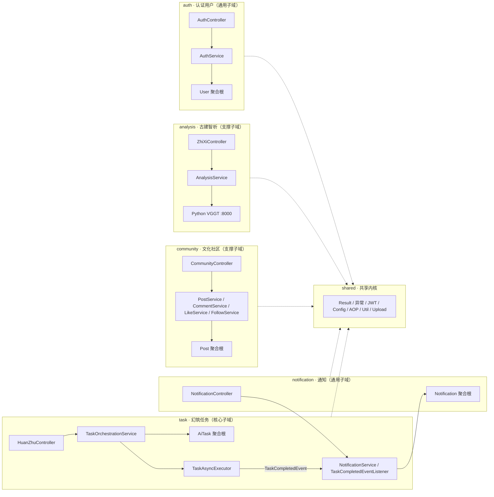
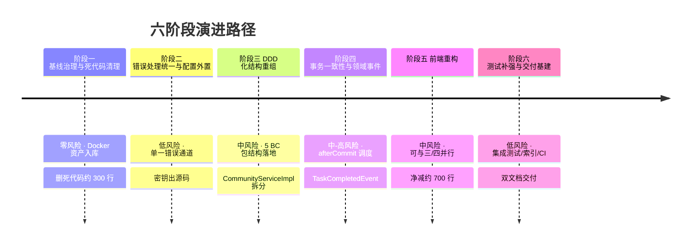

# 智观·古建平台（ArchiVision Heritage）现状评估与优化方向总览

> **文档性质**：架构评估报告 + 目标架构设计（为什么优化）
> **配套文档**：《02-具体改造执行计划》（怎么做）
> **适用范围**：backend（Spring Boot 3.2.5）与 frontend（Vue 3 + Vite 5）全栈
> **结论先行**：当前架构**无需推翻重写**。采用「渐进式 DDD-lite 分层改造」，在保持单体与现有技术栈的前提下，通过 6 个低侵入阶段完成结构重组与工程化治理，后端净增约 450 行、前端净减约 700 行，每阶段结束系统均可运行可测试。

---

## 目录

1. [项目概述与建设背景](#1-项目概述与建设背景)
2. [环境与约束](#2-环境与约束)
3. [架构评估方法论](#3-架构评估方法论)
4. [现状问题清单](#4-现状问题清单)
5. [目标架构设计（DDD）](#5-目标架构设计ddd)
6. [优化方向总览与演进路径](#6-优化方向总览与演进路径)
7. [附录](#7-附录)

---

## 1. 项目概述与建设背景

### 1.1 项目定位

智观·古建（ArchiVision Heritage）是一个**面向古建筑数字孪生与文化传承的 Web 平台**，核心价值主张是：用 AI 能力将古建筑知识以「可生成、可解析、可交流」的数字化形态呈现给大众。平台包含三大核心业务与一个管理后台：

| 业务模块 | 功能描述 | 技术实现性质 |
|---|---|---|
| 一键幻筑（HuanZhu） | 用户提交描述词，异步生成古建 3D 模型资产 | 模拟实现（Thread.sleep 模拟推理） |
| 古建智析（ZhiXi） | 上传古建图片，VGGT 结构解析并返回构件要素 | 真实链路（RestTemplate 转发 Python FastAPI） |
| 文化社区（Community） | 帖子发布/审核、评论、点赞、关注、个人中心 | 完整实现 |
| 管理后台 | 帖子审核、待审列表 | 完整实现 |

### 1.2 技术栈与部署形态

**后端**（`backend/`，约 2,300 行 main 代码 / 65 个文件 + 1,800 行测试 / 72 个单测）：

- Spring Boot 3.2.5 / Java 17 / Maven
- MyBatis-Plus 3.5.5（BaseMapper + LambdaQueryWrapper，SQL 零 XML）
- MySQL 8（`zhiguan_gujian` 库，9 张表）、Redis（Lua 幂等锁 + 分布式限流）
- JWT 无状态鉴权（JJWT 0.12.5）+ Spring Security
- AOP `@RateLimit` 注解式限流、Actuator + Prometheus 指标

**前端**（`frontend/`，约 4,100 行 / 23 个文件）：

- Vue 3（`<script setup>`）+ Vite 5 + Vue Router 4 + Pinia
- Element Plus 2.7（按需引入）+ Axios 拦截器封装
- 构建产物按路由分包（dist 中可见 per-view chunk）

**部署**：Docker Compose 5 容器（mysql / redis / vggt-api / backend / frontend），前后端分离，Nginx 反代 `/api/` 与 `/assets/`。

### 1.3 建设历程与现状基线

- 项目于 **2026-05-14 单日内从零建成**，git 历史仅 4 次提交，均在同一天
- 当前工作区有 58 项未提交改动（43 个修改 + 15 个未跟踪新文件，含全部 Docker 资产、`TaskAsyncExecutor`、`UploadController`）
- 代码规模统计（以 2026-08 快照为准）：

| 模块 | 文件数 | 行数 | 备注 |
|---|---|---|---|
| 后端 main | 65 | ≈2,300 | 无超过 500 行的文件 |
| 后端 test | 11 | ≈1,800 | 72 个单测，全 Mockito |
| 前端 src | 23 | ≈4,100 | 4 个文件超 400 行 |
| init.sql | 1 | 293 | 9 表 + 种子数据 |
| vggt-api | 1 | 156 | FastAPI 模拟推断 |

> **基线判断**：这是一个功能完整、代码卫生尚可（无 TODO/FIXME/System.out.println）的**单体 Demo 级应用**。架构问题的本质不是「选型错误」，而是**职责边界失守与工程化缺失**——这正是本方案可以"少改代码"解决问题的前提。

---

## 2. 环境与约束

### 2.1 运行环境

- **本地开发**：`start.bat` 一键启动 8000（vggt-api）/ 8080（backend）/ 5173（frontend）
- **Docker 部署**：compose 5 容器，backend 健康检查走 `/actuator/health`
- **外部依赖**：MySQL 8（3306）、Redis（6379）、Python VGGT API（8000，**可选**——未启动时智析接口返回 503 降级）

### 2.2 硬性约束（本次优化的前提）

1. **保持单体**：不引入微服务、不拆分进程
2. **渐进式改造**：不推倒重写，所有阶段独立可交付
3. **尽量少改代码**：以「搬移 > 拆分 > 新建」为优先级，纯删除与纯搬移优先
4. **每阶段可运行可测试**：阶段结束时系统必须通过全部既有测试与冒烟链路

### 2.3 质量目标优先级

| 优先级 | 目标 | 理由 |
|---|---|---|
| P1 | 数据一致性（事务边界） | P0 级缺陷直接威胁任务/资产/通知数据 |
| P2 | 可维护性（职责边界） | 上帝类与 Controller 泄漏是后续演进的最大障碍 |
| P3 | 可测试性 | 零集成测试是回归风险的根源 |
| P4 | 可观测性 | SQL 全量日志、无生产日志配置 |
| P5 | 性能 | **当前不是瓶颈**（数据量小），仅修正内存分页这一结构性隐患 |

### 2.4 非目标（明确划线）

- ❌ 不做微服务拆分、不引入消息队列
- ❌ 不真实接入 AI 3D 推理（幻筑保持模拟实现，预留接口）
- ❌ 不重写前端、不做 TypeScript 全量迁移
- ❌ 不引入 CQRS / Event Sourcing / 分库分表

---

## 3. 架构评估方法论

### 3.1 评估维度

从 8 个维度对现有架构进行定性 + 定量评估：

1. **职责边界**：Controller 是否只做参数解析与 HTTP 语义？Service 是否单一职责？
2. **分层纯度**：是否出现跨层直连（Controller→Mapper）、旁路依赖？
3. **事务一致性**：@Transactional 边界是否正确，异步与事务是否冲突？
4. **错误处理**：是否单一错误通道？HTTP 状态码与业务码是否一致？
5. **可测试性**：单测/集成测试覆盖情况，测试基建是否被使用？
6. **配置管理**：密钥与参数是否外置，是否存在硬编码？
7. **前端工程化**：组件复用、重复代码、死代码、构建配置。
8. **交付与运维**：部署资产是否入库、索引完整性、日志与 CI。

### 3.2 评估手段

- 源码逐包审查（controller / service / mapper / config / security / aop / exception / utils）
- 调用链追踪：Controller → Service → Mapper / 外部 API / Redis Lua
- 行数与扇出统计（超长文件、死代码引用 grep 验证）
- 既有测试运行结果（72 个单测全部通过，surefire 报告核对）

### 3.3 问题分级标准

| 级别 | 定义 | 例子 |
|---|---|---|
| **P0** | 阻塞性缺陷：数据一致性风险、系统性错误语义 | 事务边界错误、3 事务无一致性 |
| **P1** | 高风险：安全、架构性坏味道 | 密钥明文、Controller 泄漏、上帝类 |
| **P2** | 中风险：性能隐患、工程化缺失 | 内存分页、缺索引、部署资产未入库 |
| **P3** | 低风险：整洁度、死代码 | 死代码、重复代码、命名瑕疵 |

---

## 4. 现状问题清单

> 每条问题给出 **现象 → 代码位置（证据）→ 影响**。行号以 2026-08-05 代码快照为准。

### 4.1 P0 — 阻塞性缺陷

#### P0-1 事务边界错误：@Transactional 包裹 @Async 调度

- **现象**：`TaskOrchestrationServiceImpl.submitHuanZhuTask` 标有 `@Transactional`（`backend/src/main/java/com/zhiguan/gujian/service/impl/TaskOrchestrationServiceImpl.java:58-91`），但在事务内调用 `taskAsyncExecutor.executeAsync`（同文件 :89）。
- **证据**：异步线程与主事务不共享数据库连接。异步线程可能在主事务**提交之前**执行 `aiTaskMapper.selectById`（`TaskAsyncExecutor.java:44`），若读到不存在的任务则走「任务不存在，跳过执行」分支（`TaskAsyncExecutor.java:45-51`）并释放幂等锁——**任务被幻读丢弃**。
- **影响**：高并发下偶发任务丢失；幂等锁提前释放导致重复提交穿透。

#### P0-2 异步执行器内 3 个独立事务，无一致性

- **现象**：`TaskAsyncExecutor.executeAsync`（`TaskAsyncExecutor.java:42-96`）中，`modelAssetMapper.insert`（:64-68）、`aiTaskMapper.updateById(SUCCESS)`（:70-71）、`notificationMapper.insert`（:74-79）是 **3 个相互独立的自动提交事务**。
- **证据**：`@Async` 方法无 `@Transactional`；若通知插入失败，catch 分支只更新任务状态为 FAILED（:84-88），**已插入的 asset 无法回滚**。
- **影响**：任务失败但资产残留；资产存在但通知缺失，数据不一致。

#### P0-3 错误处理双通道 + @Valid 校验失败返回 500

- **现象**：
  - 通道 A：`GlobalExceptionHandler`（`backend/src/main/java/com/zhiguan/gujian/exception/GlobalExceptionHandler.java`）通过 `ResponseEntity.status(code)` 返回**真实 HTTP 状态码**（:18-24）。
  - 通道 B：Controller 内联 `Result.fail(...)` 共 **9 处**（`ZhiXiController.java:75,81`、`UploadController.java:39,44,57,67`、`CommunityController.java:90,107,121,126,129`），返回的 **HTTP 状态码恒为 200**。
  - `GlobalExceptionHandler` 只有 2 个 handler（:18-31），**缺失 `MethodArgumentNotValidException` 处理器**——`@Valid` 校验失败（如 `RegisterRequest` 的 `@Size`、`CreatePostRequest`）会掉进兜底 `Exception` 分支返回 500「系统内部错误」。
- **影响**：前端必须同时兼容两种语义；校验错误被误报为 500；`HttpStatus.resolve(e.getCode())` 依赖业务码恰好是合法 HTTP 码（`GlobalExceptionHandler.java:21`），脆弱。

### 4.2 P1 — 高风险

#### P1-1 ZhiXiController：整段 HTTP 转发 + 降级逻辑在 Controller

- **证据**：`ZhiXiController.java:44-83`，multipart 封装（:47-68）、错误降级（:78-82）全部内联在 Controller 方法中，无 Service 层；`ZhiXiController.java:35` 外部 URL 依赖 `@Value` 注解默认值，与 `RestTemplateConfig` 的解耦不完整。另外 :88 直接返回 `List<AnalysisDemo>` **实体**、:72 返回裸 `Map<String,Object>`。
- **影响**：Controller 无法单测；降级策略与业务规则（限流、重试、超时）无法复用；API 契约不受类型保护。

#### P1-2 CommunityController 直连 Mapper + PasswordEncoder

- **证据**：`CommunityController.java:27-28` 注入 `UserMapper` 与 `PasswordEncoder`；个人中心 4 个接口 `getCurrentUser`（:87-99）、`updateProfile`（:104-114）、`changePassword`（:118-134）全部在 Controller 内直接读写数据库；:91 手拼 `Map.of(...)` 替代 UserDTO——**User 实体没有对外 DTO**；:104/:118 用 `Map<String,String>` 作为请求体，**无校验**。
- **影响**：分层被击穿；密码校验/编码逻辑无法单测；API 契约脆弱。

#### P1-3 CommunityServiceImpl 上帝类

- **证据**：`CommunityServiceImpl.java` 428 行，一个 Service 承担 **6 类职责**（帖子 CRUD + 审核、评论、点赞、关注、个人中心聚合），接口 `CommunityService.java:15-46` 共 **14 个方法**。
- **影响**：任何单点修改都可能波及无关功能；无法按领域独立演进与测试。

#### P1-4 密钥与凭证明文

- **证据**：JWT SECRET 硬编码在源码 `JwtUtil.java:14`（`"ZhiGuan-GuJian-2024-SecretKey-..."`），过期时间写死 :15；MySQL 密码明文在 `application.yml:11-15`（`a82711045`）；docker-compose 默认值同密码。
- **影响**：密钥泄露=全量 token 可伪造；无法按环境注入。

### 4.3 P2 — 中风险

| 编号 | 问题 | 证据 | 影响 |
|---|---|---|---|
| P2-1 | 缺 3 个关键索引 | `init.sql`：`like_record` 点赞统计查询 `WHERE target_id=? AND target_type=?` 无索引（唯一索引 `uk_user_target` 以 user_id 打头）；`notification(user_id, is_read)` 未读数高频查询无联合索引；`ai_task` 无 `updated_at` 索引 | 数据量增长后查询退化全表扫 |
| P2-2 | 内存分页 | `CommunityServiceImpl.getUserLikedPosts` :302-334：先 `selectList` 全量加载该用户**所有**点赞记录再 `subList` 分页，无 SQL LIMIT | 点赞量大时内存爆炸 |
| P2-3 | SQL 全量日志 + debug 级日志 | `application.yml:40-42`：`mybatis-plus.log-impl: StdOutImpl` + `logging.level.com.zhiguan.gujian: debug` | 生产环境性能与敏感信息泄漏隐患 |
| P2-4 | Docker 资产全部未入库 | `docker-compose.yml`、backend/frontend/vggt-api 三个 Dockerfile、`application-docker.yml`、`vggt-api/` 均为 git 未跟踪文件 | 换机器/CI 环境即丢失；无法版本管理 |
| P2-5 | 无数据库迁移框架 | 无 Flyway/Liquibase，`init.sql` 是唯一 DDL 来源（全量重建式） | 已有库升级只能手动改表 |
| P2-6 | 种子数据 bug | `init.sql:146-162`：`demo_user` 与 `admin` 的 bcrypt hash **完全相同**（注释声称 demo123，实际都是 admin123） | 演示账号密码与文档不符 |
| P2-7 | 零集成测试 | `BaseTest.java`（@SpringBootTest + H2 test profile）**无任何类继承**；`RateLimitAspect`、`IdempotentLockService`、`TaskAsyncExecutor`、全部 Controller 无测试 | 回归风险无兜底 |
| P2-8 | 幻筑任务占线程池 | `TaskAsyncExecutor.java:61` `Thread.sleep(3000~7000ms)` 模拟推理；线程池仅 core=4/max=8（`AsyncConfig.java:17-19`） | 8 个并发任务即打满池子，后续任务排队 |

### 4.4 P3 — 低风险（整洁度）

**后端死代码**（grep 验证无调用方）：

| 死代码 | 位置 | 说明 |
|---|---|---|
| `TaskStatusEnum` | `constant/TaskStatusEnum.java` | 完全未用，状态实际用魔法字符串 "PENDING/RUNNING/..." |
| `CulturalLexicon` + `PromptEnhancerUtil` | `constant/CulturalLexicon.java` + `utils/PromptEnhancerUtil.java` | 互相引用，已被 `AncientDictUtil` 取代 |
| `FileUtil.generateMockAssetPath` | `utils/FileUtil.java:52-55` | 无调用方 |
| `isFollowing` / `getFollowerCount` / `getFollowingCount` | `CommunityService` + `CommunityServiceImpl.java:242-262` | 接口与实现均无 Controller 调用 |
| `TaskOrchestrationService.getNotifications` | 接口透传（`TaskOrchestrationServiceImpl.java:122-125`） | 无调用方 |

**其他**：

- `Result.java` 放在 `config` 包（应为 common/dto）；重复 `@EnableAsync`（`ZhiguanApplication.java:6` 与 `AsyncConfig.java:11`）
- 日期格式化常量重复：`CommunityServiceImpl.java:37` 与 `NotificationServiceImpl.java:23` 各一份
- `like/comment` 批量计数逻辑同构重复（`CommunityServiceImpl.java:376-402`）；`DuplicateKeyException` 并发兜底重复（:203-212 与 :229-237）
- 前端 4 个超 400 行文件：`App.vue`(598)、`CommunityFeedView.vue`(577)、`UserProfileView.vue`(503)、`PostDetailView.vue`(457)
- 前端重复代码：`parseTags` 逐字重复两处、乐观点赞逻辑重复、`::-webkit-scrollbar` CSS 重复 8 次、loading try/catch 模板约 8 处、`records||data` 兜底 4 处、JWT 解码逻辑重复（router guard + store）
- 前端死代码：`@google/model-viewer` 依赖未使用、`checkTaskSuccess`/`brocadeTaskId`（stores/notification.js:33-39）、`setUserInfo`（stores/user.js:19）、`getDemos`（api/zhixi.js:7）、`unreadCount` 拉取未渲染、`ZhiXiView.vue:104` 硬编码配额、`HuanZhuView.vue:69-70` 死按钮
- 前端双重 toast：request.js 拦截器已统一 `ElMessage.error`，部分 view catch 再弹一条（`LoginView.vue:67`、`ZhiXiView.vue:136` 等）

### 4.5 问题影响矩阵（总索引）

| 编号 | 问题 | 影响面 | 修复成本 | 归属阶段 |
|---|---|---|---|---|
| P0-1 | 事务包异步 | 幻筑链路 | 低（改调度时序） | 阶段四 |
| P0-2 | 3 事务无一致性 | 幻筑链路 | 中（单事务+事件） | 阶段四 |
| P0-3 | 错误双通道/校验 500 | 全后端 | 低（补 handler+替换） | 阶段二 |
| P1-1 | Controller 内联转发 | 智析链路 | 中（下沉 Service） | 阶段三 |
| P1-2 | Controller 直连 Mapper | 个人中心 | 低（迁往 auth BC） | 阶段三 |
| P1-3 | 上帝类 | 社区链路 | 中（拆 4 Service） | 阶段三 |
| P1-4 | 密钥明文 | 全系统 | 低（配置外置） | 阶段二 |
| P2-1/6 | 索引/种子 bug | 数据库 | 低（DDL） | 阶段六 |
| P2-2 | 内存分页 | 社区链路 | 低（改 SQL 分页） | 阶段六 |
| P2-3/4 | 日志/资产入库 | 运维 | 低 | 阶段一/六 |
| P2-5 | 无迁移框架 | 运维 | 中 | 暂缓（长期演进，见文档二 §9） |
| P2-7 | 零集成测试 | 全系统 | 中（补测试） | 阶段六 |
| P2-8 | 线程池占用 | 幻筑链路 | 低（参数外置） | 阶段四 |
| P3-* | 死代码/重复 | 全栈 | 低（纯删除） | 阶段一/五 |

---

## 5. 目标架构设计（DDD）

### 5.1 目标架构原则：DDD-lite

本方案采用 **DDD-lite**：**只借用 DDD 的组织坐标系（有界上下文、分层职责、聚合），不引入任何新框架**，全部基于现有 Spring Boot 能力落地。四条核心原则：

1. **有界上下文（Bounded Context）划分**：按业务能力切分模块，上下文内自治、上下文间只通过门面（application 层）或领域事件协作
2. **分层职责**：interfaces → application → domain → infrastructure 四层，依赖方向单向向内
3. **聚合内聚**：以聚合根组织实体，保证不变量在聚合内闭合
4. **跨上下文解耦**：跨上下文协作走 application 门面或 Spring `ApplicationEventPublisher`（**不引入 MQ**）

> **为什么是 DDD-lite 而不是标准 DDD？** 标准 DDD 要求领域模型承载业务规则、仓储抽象、防腐层等完整机制，会引入大量接口抽象，与「尽量少改代码」约束冲突。本项目业务规则简单（状态机 4 态、审核流、点赞幂等），**组织结构的收益远大于模型化收益**，因此只取 DDD 的骨架。

### 5.2 领域与子域映射

| DDD 概念 | 本项目映射 |
|---|---|
| 领域（Domain） | 古建筑数字资产运营 |
| 核心子域 | **幻筑任务**（AI 生成链路，差异化价值所在） |
| 支撑子域 | 文化社区、古建智析 |
| 通用子域 | 认证用户、通知 |
| 共享内核（Shared Kernel） | Result 响应、异常体系、JWT 安全、通用配置、上传、限流 |

### 5.3 有界上下文划分（5 BC + shared）



**依赖规则**：

- 5 个 BC 之间**禁止**相互依赖 domain 内部；跨 BC 协作仅限：application 门面调用、领域事件发布/监听
- 所有 BC 可依赖 `shared`（Result、异常、JWT、配置）
- 现状中的跨 BC 直插（`TaskAsyncExecutor` 直插 `NotificationMapper`）在阶段四收敛为事件

### 5.4 各 BC 职责边界与聚合设计

| BC | 类型 | 聚合根 | 聚合内实体/值对象 | 关键不变量 |
|---|---|---|---|---|
| auth | 通用 | **User** | — | 用户名唯一；密码必须 bcrypt；role 白名单 |
| task | 核心 | **AiTask** | ModelAsset（子实体） | 幂等键唯一（同 prompt 不重复提交）；状态机 PENDING→RUNNING→SUCCESS/FAILED 合法迁移；任务完成前资产不可见 |
| analysis | 支撑 | 无强聚合 | AnalysisResult（值对象）、AnalysisDemo（过渡实体） | 限流（每用户每日 5 次）；503 降级策略 |
| community | 支撑 | **Post** | Comment、LikeRecord（聚合内实体） | 审核通过才对外可见（PENDING→APPROVED/REJECTED）；点赞唯一（幂等）；评论必须挂有效帖子；FollowRecord 为独立小聚合（归 community 以最小化移动，文档中注明此取舍） |
| notification | 通用 | **Notification** | — | 按 user_id 归属；is_read 单调置位 |

### 5.5 四层职责「允许/不允许」表

| 层 | 允许 | 不允许 |
|---|---|---|
| **interfaces**（Controller） | 参数解析、DTO 转换、@Valid 校验、@RateLimit、认证上下文提取、HTTP 语义 | ❌ 读写 Mapper ❌ 业务规则 ❌ 外部调用 ❌ 手拼 Map 响应 |
| **application**（Service） | 用例编排、事务边界、门面、领域事件发布 | ❌ 直接依赖其他 BC 的 domain ❌ HTTP 细节 |
| **domain**（模型/常量/事件） | 聚合根、实体、值对象、状态机规则、领域事件 | ❌ 依赖 Mapper/Spring ❌ 依赖其他 BC |
| **infrastructure**（Mapper/Redis/HTTP Client） | 数据访问、外部 API 适配、幂等锁 | ❌ 业务规则 ❌ 被 interfaces 直接调用 |

### 5.6 目标包结构

```
com.zhiguan.gujian
├── auth/                        # BC1 认证用户
│   ├── interfaces/              # AuthController, ProfileController(新建), dto
│   ├── application/             # AuthService(+Impl), UserApplicationService(新建)
│   ├── domain/                  # User
│   └── infrastructure/          # UserMapper
├── task/                        # BC2 幻筑任务（核心子域）
│   ├── interfaces/              # HuanZhuController, dto
│   ├── application/             # TaskOrchestrationService(+Impl), TaskAsyncExecutor
│   ├── domain/                  # AiTask, ModelAsset, TaskStatus(常量类), event/TaskCompletedEvent(新建)
│   └── infrastructure/          # AiTaskMapper, ModelAssetMapper, IdempotentLockService
├── analysis/                    # BC3 古建智析
│   ├── interfaces/              # ZhiXiController(瘦身), dto
│   ├── application/             # AnalysisService(新建: 转发+降级+列表)
│   ├── domain/                  # AnalysisDemo, AnalysisResult(值对象)
│   └── infrastructure/          # AnalysisDemoMapper
├── community/                   # BC4 文化社区
│   ├── interfaces/              # CommunityController(瘦身), dto
│   ├── application/             # PostService, CommentService, LikeService, FollowService(新建, 接口+Impl)
│   ├── domain/                  # Post, Comment, LikeRecord, FollowRecord
│   └── infrastructure/          # PostMapper, CommentMapper, LikeRecordMapper, FollowRecordMapper
├── notification/                # BC5 通知
│   ├── interfaces/              # NotificationController, dto
│   ├── application/             # NotificationService(+Impl), TaskCompletedEventListener(新建)
│   ├── domain/                  # Notification
│   └── infrastructure/          # NotificationMapper
└── shared/                      # 共享内核
    ├── common/                  # Result(自 config 迁入), CulturalApiException, GlobalExceptionHandler
    ├── security/                # JwtUtil, JwtAuthenticationFilter
    ├── config/                  # Security/Cors/WebMvc/MybatisPlus/Redis/RestTemplate/Async Config
    ├── aop/                     # RateLimit + RateLimitAspect
    ├── util/                    # AncientDictUtil, FileUtil(裁剪)
    └── web/                     # UploadController(通用上传), AdminController(管理面)
```

**文件映射要点**（详见《02-具体改造执行计划》第三章）：

- **原样搬移 ≈50 个文件**：5 个 Controller（Auth/Admin/HuanZhu/Notification/Upload）、9 个 Mapper、8 个 model、3 个 Service 接口+实现（Auth/Notification/TaskOrchestration）、10 个 DTO、JwtUtil、JwtAuthenticationFilter、8 个 Config、RateLimit+切面、AncientDictUtil —— 全部为纯包移动，IDE Move Class 自动改 import，**零逻辑改动**；AdminController 整体迁入 shared/web（其帖子审核接口与 community 相关，细化拆分留作后续演进，见《02》§4.1 注）
- **拆分**：`CommunityServiceImpl`（→4 个 Service）、`CommunityService`（→4 个接口）、`ZhiXiController`（瘦身 99→约 30 行）、`CommunityController`（个人中心迁出）
- **新建 ≈8 个文件**：ProfileController、UserApplicationService、AnalysisService、Post/Comment/Like/Follow Service（接口+Impl）、TaskStatus、TaskCompletedEvent、TaskCompletedEventListener
- **删除**：阶段一的死代码清单

### 5.7 目标数据模型

**9 张表字段零变更**——DDD 化不触碰数据库结构，零数据风险。仅阶段六补充 3 个索引：

```sql
ALTER TABLE like_record ADD INDEX idx_target (target_id, target_type);
ALTER TABLE notification ADD INDEX idx_user_read (user_id, is_read);
ALTER TABLE ai_task ADD INDEX idx_updated_at (updated_at);
```

---

## 6. 优化方向总览与演进路径

### 6.1 五大优化方向

| 方向 | 目标态（改造后长什么样） |
|---|---|
| **结构 DDD 化** | 5 BC 包结构落地；Controller 全部薄化（只做参数解析与 HTTP 语义）；无上帝类；跨 BC 协作走门面/事件 |
| **错误与一致性** | 单一错误通道（全部抛 CulturalApiException，GlobalExceptionHandler 统一映射 HTTP 状态）；@Valid 返回 400；幻筑任务单事务 + 事件驱动通知 |
| **配置与安全** | JWT SECRET/DB 密码/线程池/超时全部外置 yml + 环境变量；生产 profile 关闭 SQL 日志 |
| **前端工程化** | 公共工具/composable 收敛重复代码；组件化拆分大文件；死代码清零；无双重 toast |
| **测试与交付基建** | 关键链路测试全覆盖（含首个集成测试）；3 索引入库；Docker 资产入库；CI 流水线；环境变量化 |

### 6.2 演进路径总览（6 阶段）



| 阶段 | 风险 | 代码量 | 验收标准（概要） |
|---|---|---|---|
| 一 | 低 | 删约 300 行 / 8 文件 | 72 单测绿 + 6 链路冒烟 + Docker 资产入库 |
| 二 | 低-中 | 约 12 文件 / 增 80 行 | @Valid 返 400；密钥出源码；单测绿 |
| 三 | 中 | 搬 55 文件 + 新建约 250 行 | 编译零警告；单测绿；6 链路冒烟 |
| 四 | 中-高 | 约 4 文件 / 增 180 行 | TaskAsyncExecutor 单测 + 20 并发压测通过 |
| 五 | 中 | 约 20 文件 / 净减 700 行 | build 通过 + UI 回归 10 项 |
| 六 | 低 | 测试增约 1000 行 + 5 配置 | CI 绿；双文档交付 |

### 6.3 收益与成本

| 指标 | 估算 |
|---|---|
| 后端净增代码 | 约 450 行（新增 Service 拆分、事件、handler） |
| 前端净减代码 | 约 700 行（死代码清除 + 重复收敛） |
| 删除死代码 | 约 300 行（后端）+ 约 200 行（前端） |
| 测试新增 | 约 1,000 行 |
| 工作量 | 单开发者 6-10 人日（每阶段独立交付） |
| 风险总评 | 低-中：全部高风险改动集中在阶段四，其余均为搬移与清理 |

**收益**：单一错误通道（前端契约稳定）、事务一致性（数据可靠）、分层清晰（可独立演进）、密钥安全（配置外置）、可测试（集成测试兜底）、可交付（资产入库 + CI）。

---

## 7. 附录

### 附录 A：DDD 术语表

| 术语 | 中文释义 | 本项目对应 |
|---|---|---|
| Bounded Context | 有界上下文：业务能力的边界，上下文内模型自治 | auth/task/analysis/community/notification |
| Aggregate Root | 聚合根：聚合内实体的唯一入口，保证不变量 | User / AiTask / Post / Notification |
| Entity | 实体：有唯一标识、有生命周期的对象 | User、AiTask、Post、Comment 等 |
| Value Object | 值对象：无标识、不可变、按值相等 | AnalysisResult |
| Domain Event | 领域事件：领域内已发生事实的发布与订阅 | TaskCompletedEvent |
| Shared Kernel | 共享内核：多个上下文共享的通用部分 | Result、异常体系、JWT、配置 |
| Core / Supporting / Generic Subdomain | 核心/支撑/通用子域：按业务差异化程度划分 | 核心=幻筑任务；支撑=社区/智析；通用=认证/通知 |
| DDD-lite | 本方案自定义：借用 DDD 组织结构而不引入全套建模机制 | — |

### 附录 B：问题清单详表

见 §4 各分节；汇总表见 §4.5 影响矩阵。

### 附录 C：代码规模统计表

见 §1.3。

### 参考文献

1. Eric Evans, *Domain-Driven Design: Tackling Complexity in the Heart of Software*, Addison-Wesley, 2003
2. Vaughn Vernon, *Implementing Domain-Driven Design*, Addison-Wesley, 2013
3. Martin Fowler, *Refactoring: Improving the Design of Existing Code*（2nd ed.）, Addison-Wesley, 2018
4. Spring Framework Documentation: Transaction Management / Application Events
5. 项目需求蓝图：`prompt/古建AI平台项目提示词生成.md`（V1.2 全栈开发蓝图）

---

> 下一份文档：《02-具体改造执行计划》—— 将本报告的每个阶段落地为可执行的任务清单、文件映射与验收 checklist。
