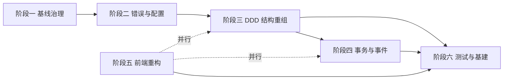
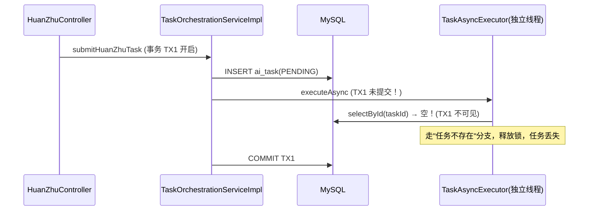

# 智观·古建平台 具体改造执行计划

> **文档性质**：工程执行手册（怎么做）
> **配套文档**：《01-现状评估与优化方向总览》（为什么）——本文档不重复理论论述，引用格式「见文档一 §5.3」
> **适用角色**：后端/前端开发者、架构评审
> **执行模式**：每阶段独立 commit、每阶段可运行可测试、以 6 条冒烟链路为门禁

---

## 目录

1. [计划总览与执行原则](#1-计划总览与执行原则)
2. [阶段一：基线治理与死代码清理（零风险）](#2-阶段一基线治理与死代码清理零风险)
3. [阶段二：错误处理统一与配置外置（低风险）](#3-阶段二错误处理统一与配置外置低风险)
4. [阶段三：DDD 化结构重组（中风险，核心）](#4-阶段三ddd-化结构重组中风险核心)
5. [阶段四：事务一致性与领域事件（中-高风险）](#5-阶段四事务一致性与领域事件中-高风险)
6. [阶段五：前端重构（中风险，可与三/四并行）](#6-阶段五前端重构中风险可与三四并行)
7. [阶段六：测试补强与交付基建（低风险）](#7-阶段六测试补强与交付基建低风险)
8. [风险总表与回滚策略](#8-风险总表与回滚策略)
9. [不该做的事清单（YAGNI）](#9-不该做的事清单yagni)
10. [附录](#10-附录)

---

## 1. 计划总览与执行原则

### 1.1 六阶段路线图

| 阶段 | 名称 | 风险 | 预计代码量 | 依赖 |
|---|---|---|---|---|
| 一 | 基线治理与死代码清理 | 低 | 删约 300 行 / 8 文件 | — |
| 二 | 错误处理统一与配置外置 | 低-中 | 约 12 文件 / 增 80 行 | 阶段一 |
| 三 | DDD 化结构重组 | 中 | 搬 55 文件 + 新建约 250 行 | 阶段一、二 |
| 四 | 事务一致性与领域事件 | 中-高 | 约 4 文件 / 增 180 行 | 阶段三 |
| 五 | 前端重构 | 中 | 约 20 文件 / 净减 700 行 | 独立，可与三/四并行 |
| 六 | 测试补强与交付基建 | 低 | 测试增约 1,000 行 + 5 配置 | 阶段三后任意 |



### 1.2 执行原则

1. **每阶段独立 commit**，commit message 格式：`refactor(phase-N): <摘要>`；回滚即 revert 该 commit
2. **大改小步**：搬移（改 import）与拆逻辑（改行为）分离为两次 commit，先搬后拆
3. **git 分支策略**：每个阶段开 `refactor/phase-N` 分支，合并回 `main` 后再开始下一阶段
4. **冒烟门禁**：每阶段结束必须通过 6 条主链路冒烟——

   | # | 链路 | 验证内容 |
   |---|---|---|
   | 1 | 登录 | admin/demo_user 登录成功、JWT 生效 |
   | 2 | 幻筑 | 提交 Prompt → 轮询状态 → SUCCESS → 资产与锦盒通知 |
   | 3 | 智析 | 上传图片 → 转发/降级返回结构数据；连续 6 次触发限流 |
   | 4 | 社区 | 发帖（普通用户 PENDING / 管理员 APPROVED）→ 评论 → 点赞 → 关注 |
   | 5 | 通知 | 未读数、列表、已读、全部已读 |
   | 6 | 后台 | admin 登录 → 待审列表 → 审核通过/驳回 |

5. **工具准备**：IDEA「Move Class」重构（自动改 import）、`grep -rn` 引用确认、`mvn test` 与 `npm run build` 双门禁

---

## 2. 阶段一：基线治理与死代码清理（零风险）

### 2.1 目标

建立可复现基线 + 清场。Docker 资产入库是**最高的非代码风险**（换机器即丢失），死代码删除是零风险收益。

### 2.2 任务清单

**A. Docker 资产入库**（未跟踪文件，`git add` 纳入版本管理）：

- `docker-compose.yml`、`backend/Dockerfile`、`backend/.dockerignore`、`backend/maven-settings.xml`、`backend/src/main/resources/application-docker.yml`、`frontend/Dockerfile`、`frontend/.dockerignore`、`vggt-api/`（整目录）、`.gitignore` 核对（dist/ 保持忽略）
- 补：`backend/.dockerignore` 与 `frontend/.dockerignore` 内容核验（避免把 target/node_modules 打进去）

**B. 死代码删除**（删除前逐项 `grep -rn` 确认无引用）：

| 删除项 | 位置 | 引用核验 |
|---|---|---|
| `TaskStatusEnum.java` | `constant/TaskStatusEnum.java` | 全库无引用，状态用魔法字符串 |
| `CulturalLexicon.java` + `PromptEnhancerUtil.java` | `constant/` + `utils/` | 仅互相引用，被 `AncientDictUtil` 取代 |
| `FileUtil.generateMockAssetPath` 方法 | `utils/FileUtil.java:52-55` | 无调用方（FileUtil 其他方法保留） |
| `CommunityService.isFollowing/getFollowerCount/getFollowingCount`（接口+实现） | `CommunityService.java` + `CommunityServiceImpl.java:242-262` | Controller 均未调用 |
| `TaskOrchestrationService.getNotifications` 透传 | `TaskOrchestrationServiceImpl.java:122-125` | NotificationController 直接注入 NotificationService |
| 重复 `@EnableAsync` | `ZhiguanApplication.java:6` 或 `AsyncConfig.java:11` 二选一保留 | 保留 AsyncConfig（集中配置） |

**C. 种子数据修复**：`init.sql:146-162` 为 `demo_user` 生成独立的 bcrypt hash（与 admin 区分，注释与 hash 一致）。

**D. 文档同步**：`README.md` 账号说明与 init.sql 一致。

### 2.3 代码量

删约 250-300 行（Java），涉及约 8 个文件 + init.sql 1 处修改。

### 2.4 风险与回滚

- **风险：低**。全部为纯删除与纯入库，无行为改动
- **回滚**：`git revert` 阶段一 commit 即完全恢复

### 2.5 验收 checklist

- [ ] `git status` 中 docker-compose.yml、三个 Dockerfile、application-docker.yml、vggt-api/ 已跟踪
- [ ] `cd backend && mvn test`：72 个既有单测全绿
- [ ] 6 条冒烟链路全部通过
- [ ] `grep -rn "TaskStatusEnum\|CulturalLexicon\|PromptEnhancerUtil\|generateMockAssetPath" backend/src` 零命中

---

## 3. 阶段二：错误处理统一与配置外置（低风险）

### 3.1 目标

单一错误通道、契约稳定、密钥出源码。**这是 P0-3 与 P1-4 的修复阶段**（问题编号见文档一 §4）。

### 3.2 任务清单

**A. GlobalExceptionHandler 补 handler**（`backend/src/main/java/com/zhiguan/gujian/exception/GlobalExceptionHandler.java`，现状仅 2 个 handler）：

```java
@ExceptionHandler(MethodArgumentNotValidException.class)
public ResponseEntity<Result<Void>> handleValidation(MethodArgumentNotValidException e) {
    String msg = e.getBindingResult().getFieldErrors().stream()
            .map(fe -> fe.getField() + ": " + fe.getDefaultMessage())
            .collect(Collectors.joining("; "));
    return ResponseEntity.status(HttpStatus.BAD_REQUEST).body(Result.fail(400, msg));
}

@ExceptionHandler(HttpMessageNotReadableException.class)   // 请求体解析失败 → 400
@ExceptionHandler(MaxUploadSizeExceededException.class)    // 超限 → 413
```

**B. 9 处内联 `Result.fail` → 抛 `CulturalApiException`**（逐处替换，保持 message 不变）：

| 位置 | 现状 | 替换为 |
|---|---|---|
| `ZhiXiController.java:75` | `Result.fail(502, ...)` | `throw new CulturalApiException(502, ...)` |
| `ZhiXiController.java:81` | `Result.fail(503, ...)` | `throw new CulturalApiException(503, ...)` |
| `UploadController.java:39,44,57,67` | 4 处 | 同模式（400/413） |
| `CommunityController.java:90,107,121,126,129` | 5 处 | 同模式（404/400） |

> 注意：`GlobalExceptionHandler` 的 `HttpStatus.resolve(code)` 会把 400/404/413/502/503 正确映射为真实 HTTP 状态（`GlobalExceptionHandler.java:21`）。前端 request.js 按 `body.code` 解包，行为不变；**需回归验证**智析 503 降级提示文案仍正常展示。

**D. 上传大小口径统一**：`UploadController.java:23` 的 `MAX_FILE_SIZE = 5MB` 与 `application.yml` 的 `servlet.multipart.max-file-size: 50MB` 不一致——统一按 5MB 口径配置 yml，超限时由新增的 `MaxUploadSizeExceededException` handler 返回 413（前端提示与后端一致）。

**C. 配置外置**：

| 配置项 | 位置 | 改法 |
|---|---|---|
| JWT SECRET + 过期时间 | `security/JwtUtil.java:14-15` | `@Value("${zhiguan.jwt.secret}")` + `@Value("${zhiguan.jwt.expiration}")`；yml 提供默认值，生产用 `JWT_SECRET` 环境变量覆盖 |
| MySQL 密码 | `application.yml:11-15` + `application-docker.yml` | `${DB_PASSWORD:...}` 占位；`.env` 提供 |
| 线程池参数（随阶段四） | `AsyncConfig.java:17-19` | 外置 yml `zhiguan.task.pool.*` |
| VGGT URL 收敛 | `ZhiXiController.java:35` | 保留 `@Value`，阶段三下沉时统一进 `AnalysisService` |

### 3.3 代码量

约 12 文件（1 handler 扩展 + 9 处替换 + JwtUtil + 2 yml），净增约 80 行。

### 3.4 风险与回滚

- **风险：低-中**。主要风险点：① 内联 `Result.fail` 改为抛异常后 HTTP 状态从 200 变为真实状态码——前端 request.js 对非 2xx 走 HTTP 错误分支（`request.js:31-44`），message 取自 body，**行为无感**，但需用智析/上传链路实测确认提示文案
- **回滚**：revert 阶段二 commit；HTTP 语义变化若引发前端问题，回滚是最快恢复路径

### 3.5 验收 checklist

- [ ] `@Valid` 校验失败返回 HTTP 400 + 字段错误信息（原为 500）
- [ ] 智析 503 降级文案「VGGT 深度解析引擎未就绪...」正常展示（HTTP 503）
- [ ] 上传超限返回 413；注册密码格式错误返回 400
- [ ] `grep -rn "Result.fail" backend/src/main/java/com/zhiguan/gujian/controller` 仅剩阶段六前允许保留的占位（如 restoration 501）
- [ ] JWT 登录登出全链路回归；`mvn test` 全绿
- [ ] yml 中无明文密码（仅 `${...}` 占位 + `.env`）

---

## 4. 阶段三：DDD 化结构重组（中风险，核心）

> 目标包结构与聚合设计见文档一 §5.6 / §5.4。**本阶段全部为搬移与拆分，不改任何业务行为。**

### 4.1 文件映射总表

**A. 原样搬移（≈50 个文件，纯包移动，IDE Move Class 自动改 import）**：

| 目标包 | 文件 |
|---|---|
| auth/interfaces | `AuthController`、`LoginRequest`、`RegisterRequest` |
| auth/application | `AuthService`、`AuthServiceImpl` |
| auth/domain | `User` |
| auth/infrastructure | `UserMapper` |
| task/interfaces | `HuanZhuController`、`HuanZhuRequest`、`TaskStatusResponse` |
| task/application | `TaskOrchestrationService`、`TaskOrchestrationServiceImpl`、`TaskAsyncExecutor` |
| task/domain | `AiTask`、`ModelAsset` |
| task/infrastructure | `AiTaskMapper`、`ModelAssetMapper`、`IdempotentLockService` |
| analysis/interfaces | `AnalysisDemo` 相关 DTO（新建时定义） |
| analysis/domain | `AnalysisDemo` |
| analysis/infrastructure | `AnalysisDemoMapper` |
| community/domain | `Post`、`Comment`、`LikeRecord`、`FollowRecord` |
| community/infrastructure | `PostMapper`、`CommentMapper`、`LikeRecordMapper`、`FollowRecordMapper` |
| community/interfaces | `CommentRequest`、`CreatePostRequest`、`LikeRequest`、`PostBriefResponse`、`PostDetailResponse`、`CommentResponse` |
| notification/interfaces | `NotificationController`、`NotificationResponse` |
| notification/application | `NotificationService`、`NotificationServiceImpl` |
| notification/domain | `Notification` |
| notification/infrastructure | `NotificationMapper` |
| shared/common | `Result`（自 config 迁入）、`CulturalApiException`、`GlobalExceptionHandler` |
| shared/security | `JwtUtil`、`JwtAuthenticationFilter` |
| shared/config | `SecurityConfig`、`CorsConfig`、`WebMvcConfig`、`AsyncConfig`、`RedisConfig`、`MybatisPlusConfig`、`RestTemplateConfig` |
| shared/aop | `RateLimit`、`RateLimitAspect` |
| shared/util | `AncientDictUtil`、`FileUtil`（已裁剪） |
| shared/web | `UploadController` |

> 注：`AdminController` 整体迁往 `shared/web`（与文档一 §5.6 一致），其帖子审核接口与 community 相关、用户管理接口与 auth 相关，细化拆分留作后续演进——阶段三先整体搬移保持接口不变。

**B. CommunityServiceImpl 拆分方案**（428 行 → 4 个 Service，14 方法逐条归位）：

| 新 Service（community/application） | 归属方法（原 CommunityServiceImpl） |
|---|---|
| `PostService` | `getPostFeed`(:40)、`getPostDetail`(:50)、`createPost`(:108)、`getUserPosts`(:292)、`auditPost`(:268)、`getPendingPosts`(:282) |
| `CommentService` | `addComment`(:130)、`getComments`(:151) |
| `LikeService` | `toggleLike`(:193)、`getUserLikedPosts`(:302) |
| `FollowService` | `toggleFollow`(:218) |

- 私有辅助方法（`buildPostBriefPage`/`batchLoadUsers`/`batchCountLikes` 等，:338-402）随使用方归属：分页组装进 `PostService`，点赞计数进 `LikeService`
- 原 `CommunityService` 接口删除，Controller 改注入 4 个新接口
- **个人中心 4 个接口迁往 auth BC**：`CommunityController.java:86-154` 的 `getCurrentUser`/`updateProfile`/`changePassword` 迁至新建 `auth.interfaces.ProfileController` + `auth.application.UserApplicationService`（消除 Controller 直连 UserMapper/PasswordEncoder，问题 P1-2）；`getMyPosts`/`getMyLikedPosts` 留在 community（调 PostService/LikeService）
- **URL 路径不变**（`/api/v1/users/me` 等），前端零改动

**C. ZhiXiController 瘦身**（99 行 → 约 30 行，问题 P1-1）：

- 新建 `analysis.application.AnalysisService`：multipart 封装、RestTemplate 转发、503 降级、`listDemos` 迁移（:44-89 的逻辑整体下沉）
- `ZhiXiController` 只保留：`@PostMapping("/zhixi")` 参数接收 + `@RateLimit(maxCalls=5)` + 调 Service + 返回 `Result<Map>`；`restorationPredict` 501 占位保留
- `AnalysisResult` 值对象定义（可选，若需类型化返回；最小化改动时允许阶段三先用 Map 透传，阶段六再收敛）

### 4.2 迁移操作顺序（每步独立 commit）

1. **建包骨架**：创建 5 BC + shared 的包目录（空包）
2. **纯搬移**：按 §4.1-A 逐文件 Move Class（编译器全量发现遗漏 import）
3. **拆 Service**：按 §4.1-B 拆 `CommunityServiceImpl`（先抽方法、后挪类；行为不变）
4. **Controller 瘦身**：`ZhiXiController` 下沉 + `CommunityController` 个人中心迁出
5. **编译找错**：`mvn compile` 零警告；`mvn test` 全绿（既有单测会暴露搬移遗漏——注意单测引用的包路径需同步更新）
6. **冒烟回归**：6 条链路

### 4.3 代码量

搬移约 55 文件（机械 import 变更）、新建约 8 文件（4 Service 接口+Impl、ProfileController、UserApplicationService、AnalysisService）约 250 行。

### 4.4 风险与回滚

- **风险：中**。搬移遗漏靠编译器兜底；拆 Service 的行为一致性靠既有 72 单测兜底
- **回滚**：revert 阶段三 commit；如单测覆盖不足导致隐蔽回归，以冒烟门禁拦截
- **降险措施**：搬移与拆分分开 commit；每个 commit 后立即 `mvn test`

### 4.5 验收 checklist

- [ ] `mvn compile` 零错误零警告
- [ ] 72 单测全绿（含包路径更新）
- [ ] 6 条冒烟链路通过（重点：个人中心、发帖、智析）
- [ ] `grep -rn "service.impl.CommunityServiceImpl" backend/src` 零命中（无残留引用）
- [ ] 目标包结构落位：5 BC + shared 目录树与文档一 §5.6 一致
- [ ] 前端无任何改动且功能完整（URL 契约不变）

---

## 5. 阶段四：事务一致性与领域事件（中-高风险）

> 修复 P0-1 / P0-2 / P2-8（问题定义见文档一 §4.1、§4.3）。**这是全计划唯一的高风险行为改动阶段。**

### 5.1 问题根因



### 5.2 修复方案

**A. afterCommit 后触发异步**（`TaskOrchestrationServiceImpl`）：

```java
TransactionSynchronizationManager.registerSynchronization(new TransactionSynchronization() {
    @Override
    public void afterCommit() {
        taskAsyncExecutor.executeAsync(taskId, originalPrompt, userId);
    }
});
```

- 保证异步线程只在事务提交后可见任务记录；**无事务时直接调用**（兜底分支）
- 幂等锁的持有窗口从「提交前」延伸至「提交后」，锁 TTL 10 分钟不变（`IdempotentLockService` 现有逻辑）

**B. TaskAsyncExecutor 单事务化 + 领域事件**（`TaskAsyncExecutor.java:42-96`）：

- 执行器方法改为 `@Transactional`：`model_asset` 插入（:64-68）+ 任务状态更新（:70-71）+ 资产路径生成在**同一事务**内提交；失败整体回滚 → 杜绝「asset 已插入但任务 FAILED」的不一致
- 新增 `task/domain/event/TaskCompletedEvent`（携带 taskId/userId/result 信息），任务成功后 `applicationEventPublisher.publishEvent(...)`
- 通知创建迁至 `notification/application/TaskCompletedEventListener`（@TransactionalEventListener 监听），**消除 TaskAsyncExecutor 对 NotificationMapper 的跨 BC 直插**
- 状态魔法字符串 → `task/domain/TaskStatus` 常量类（PENDING/RUNNING/SUCCESS/FAILED）
- 模拟耗时与资产路径外置 yml（`zhiguan.task.simulate-min-ms / simulate-max-ms`）；线程池参数（`AsyncConfig.java:17-19`）外置 `zhiguan.task.pool.*`

### 5.3 代码量

约 4 文件改造 + 2 新建（事件、监听器）+ 配置，净增约 180 行。

### 5.4 风险与回滚

- **风险：中-高**。涉及异步时序与事务行为改动，是回归敏感区
- **降险措施**：
  - 先写 `TaskAsyncExecutor` 单测（Mockito：模拟 mapper 时序，断言单事务内状态流转）再改代码
  - 并发验收：**20 并发提交相同与不同 Prompt**，断言：任务不丢失、asset 与状态一致、通知数量=成功任务数、幂等拦截生效
- **回滚**：revert 阶段四 commit（行为改动集中，回滚面可控）

### 5.5 验收 checklist

- [ ] `TaskAsyncExecutor` 新增单测通过（正常/异常/任务不存在三分支）
- [ ] 20 并发压测：无幻读丢任务、无通知缺失、无 asset 残留
- [ ] 幂等锁：相同 Prompt 10 分钟内二次提交返回原 taskId；10 分钟后可再提交
- [ ] 通知经 `TaskCompletedEventListener` 产生（`grep NotificationMapper` 仅通知 BC 引用）
- [ ] 6 条冒烟链路通过；`mvn test` 全绿

---

## 6. 阶段五：前端重构（中风险，可与三/四并行）

### 6.1 目标

消除重复与死代码、收敛公共逻辑、组件化拆分大文件。**纯前端行为，不与后端阶段耦合。**

### 6.2 任务清单

**A. 公共层抽取**（新建 `src/utils/`、`src/composables/`）：

| 抽取项 | 来源（重复位置） | 落点 |
|---|---|---|
| `parseTags` | `CommunityFeedView.vue:251-255` 与 `PostDetailView.vue:129-133` 逐字重复 | `src/utils/format.js` |
| 时间格式化 | 多处内联 | `src/utils/format.js` |
| JWT 解码 | `router/index.js:83`（atob 手解）与 `stores/user.js:28`（parseToken）重复 | `stores/user.js` 统一导出，router guard 改为调 store |
| `records \|\| data` 分页兜底 | 4 处（CommunityFeedView:265、UserProfileView:206-207、AdminDashboardView:55、NotificationListView:50） | `src/utils/pagination.js` |
| loading try/catch 模板 | 约 8 处 | `src/composables/useAsyncAction.js`（返回 `{ loading, run }`） |
| 乐观点赞回滚逻辑 | CommunityFeedView:271-287 与 PostDetailView:144-160 | `src/composables/useOptimisticLike.js` |

**B. 组件化**：

- `PostCard.vue`（feed 卡片：封面/标题/作者/点赞/评论/标签）
- `CommentList.vue`（评论列表 + 输入框）
- `NotificationItem.vue`
- `App.vue`(598 行) 拆分：侧边栏 → `Layout/SideNav.vue`；锦盒弹窗 → `Layout/BrocadeDialog.vue`；主题切换收敛到 `stores/theme.js` 或 composable

**C. 死代码与问题修复**：

| 项 | 处理 |
|---|---|
| `@google/model-viewer` 依赖（package.json:12，0 引用） | 移除依赖（如后续接 3D 渲染再引入） |
| `checkTaskSuccess`/`brocadeTaskId`（stores/notification.js:33-39） | 删除；锦盒弹窗 `showBrocade` 保留接线口，待幻筑轮询接入 |
| `setUserInfo`（stores/user.js:19） | 删除 |
| `getDemos`（api/zhixi.js:7） | 删除（后端 demos 接口随之标记 deprecated） |
| `unreadCount` 拉取未渲染 | 接线到侧边栏 Bell 徽标（低成本 UI 收益）或删除 |
| 双重 toast | `LoginView.vue:67,86`、`ZhiXiView.vue:136`、`UserProfileView.vue:227,245,269`、`HuanZhuView.vue:119` 的 catch 分支移除自弹消息（拦截器已统一） |
| `ZhiXiView.vue:104` 硬编码配额 `{total:5, remaining:4}` | 标记 TODO 或删除展示（无后端接口） |
| `HuanZhuView.vue:69-70` 死按钮（导出 OBJ/GLTF、推演材质） | 移除或加 disabled 态 |
| `::-webkit-scrollbar` 重复 8 处 | 收敛为全局 style.css 单份 |
| style.css 中 view 专属样式（.feed-card 等 :214-380） | 按组件拆回 scoped；死样式 `.custom-scrollbar`/`.text-serif`/`.ghost-btn-disabled` 删除 |
| `.settings-card`/`.settings-divider` 全局与 scoped 重复定义 | 保留一份 |

**D. 质量门禁**：`npm run build` 通过；`grep console.log` 零命中（现状已为零，保持）。

### 6.3 代码量

约 20 文件，净减 600-800 行（新建 utils/composables/组件约 400 行，删除重复与死代码约 1,100 行）。

### 6.4 风险与回滚

- **风险：中**。UI 改动回归靠人工清单
- **回滚**：revert 阶段五 commit；每类改动（utils 抽取/组件化/死代码删除）分开 commit，细化回滚面
- **降险措施**：组件化采用「先新建组件、后替换引用」策略，避免大文件原地手术

### 6.5 验收 checklist

- [ ] `npm run build` 通过（无未使用变量警告）
- [ ] UI 回归 10 项：登录/注册、社区流、帖子详情、发帖弹窗、个人中心三弹窗、智析上传、幻筑提交与锦盒、通知列表、后台审核、夜间模式切换
- [ ] `grep -rn "parseTags\|checkTaskSuccess\|setUserInfo\|getDemos" frontend/src` 除 utils/定义处零命中
- [ ] 双重 toast 场景（登录失败、智析降级）仅弹一条

---

## 7. 阶段六：测试补强与交付基建（低风险）

### 7.1 目标

把「72 个单测、零集成覆盖」升级为「关键链路有兜底」，补齐索引、日志、CI 等交付要素。

### 7.2 任务清单

**A. 测试矩阵**：

| 测试 | 类型 | 说明 |
|---|---|---|
| `RateLimitAspectTest` | 单测 | 超限抛 429、次日清零（mock RedisTemplate） |
| `IdempotentLockServiceTest` | 单测 | Lua 脚本三分支：放行/重复/锁占用 |
| `TaskAsyncExecutorTest` | 单测 | 阶段四已建，此处补边界分支 |
| `ZhiXiControllerTest` 补全 | MockMvc | 503 降级、限流触发（继承现有 standalone MockMvc 模式） |
| `ProfileControllerTest` | MockMvc | 个人中心 4 接口 |
| `BaseTest` 复活集成测试 | **@SpringBootTest + H2** | 首个集成冒烟：登录 → 幻筑提交 → 状态轮询 → 通知产生全链路（`BaseTest.java` 已声明 H2 profile，直接继承） |

**B. 数据库**：

```sql
-- 入 init.sql（配合 CREATE TABLE 之后的 ALTER 段，供已有库升级执行）
ALTER TABLE like_record ADD INDEX idx_target (target_id, target_type);
ALTER TABLE notification ADD INDEX idx_user_read (user_id, is_read);
ALTER TABLE ai_task ADD INDEX idx_updated_at (updated_at);
```

- `CommunityServiceImpl.getUserLikedPosts`（现 :302-334 内存分页）改 SQL 分页：`selectPage` + 点赞记录子查询 join（保留排序语义）

**C. 日志治理**（`application.yml`）：

- `mybatis-plus.configuration.log-impl`：dev 保留 StdOutImpl，生产 profile 关闭
- `logging.level.com.zhiguan.gujian`：dev=debug，prod=info
- 新增 `logback-spring.xml`（生产滚动策略 + 按天归档）

**D. CI 流水线**（`.github/workflows/ci.yml` 草案）：

```yaml
name: CI
on: [push, pull_request]
jobs:
  build:
    runs-on: ubuntu-latest
    steps:
      - uses: actions/checkout@v4
      - uses: actions/setup-java@v4
        with: { java-version: '17', distribution: 'temurin' }
      - run: cd backend && mvn verify
      - uses: actions/setup-node@v4
        with: { node-version: '20' }
      - run: cd frontend && npm ci && npm run build
```

**E. 环境变量化**：`.env.example` 提交（`DB_PASSWORD`、`JWT_SECRET`、`VGGT_API_URL`），docker-compose 默认值移除明文密码。

**F. 文档交付**：两份架构文档定稿；`README.md` 与 `docs/API接口文档.md` 更新（含新增 ProfileController 与包结构变更）。

### 7.3 代码量

测试增约 1,000 行 + 5 个配置文件（logback/CI/.env.example/init.sql/yml）。

### 7.4 风险与回滚

- **风险：低**。新增为主，无删除；getUserLikedPosts 分页改为行为等价改动，单测 + 冒烟兜底
- **回滚**：单项 revert（索引与测试互不依赖）

### 7.5 验收 checklist

- [ ] `mvn verify` 全绿（含新增测试）
- [ ] 首个 @SpringBootTest 集成测试通过（H2 环境全链路）
- [ ] 3 索引 DDL 在全新库（docker-compose 重建）与已有库均可执行
- [ ] 生产 profile 启动日志无 SQL 逐行输出
- [ ] CI 在 GitHub Actions 跑通（如已推送）
- [ ] 两份架构文档与 README 同步完成

---

## 8. 风险总表与回滚策略

| 阶段 | 主要风险 | 缓解措施 | 回滚 |
|---|---|---|---|
| 一 | 死代码误删（引用遗漏） | 删除前逐项 grep；删除后 mvn test | revert 单 commit |
| 二 | HTTP 语义变化引发前端行为差异 | 前端按 body.code 解包，回归智析/上传/个人中心 | revert 单 commit |
| 三 | 搬移遗漏、拆服务行为回归 | 编译器兜底 + 72 单测 + 6 冒烟；搬移/拆分分 commit | revert 单 commit |
| 四 | 异步时序、事务边界改动 | 先写单测后改码 + 20 并发压测 | revert 单 commit |
| 五 | UI 回归 | 组件化采用新建替换策略 + 10 项 UI 清单 | revert 单 commit |
| 六 | 分页改写引入回归 | 行为等价改写 + 单测 | 单项 revert |

**通用回滚原则**：任何阶段验收失败 → 立即 `git revert <phase commit>`，不带着失败继续前进；阶段之间用 `refactor/phase-N` 分支隔离。

---

## 9. 不该做的事清单（YAGNI）

| 不做 | 理由 | 替代方案 |
|---|---|---|
| 微服务拆分 | 单体 2,300 行，拆分引入分布式复杂度远大于收益 | 模块化单体（本方案） |
| 消息队列 | 唯一跨 BC 协作是任务完成通知，单进程内事件足够 | Spring `ApplicationEventPublisher` + `@TransactionalEventListener` |
| CQRS / Event Sourcing | 读写模型同构，无高频写放大 | 保持单模型 |
| Testcontainers 强依赖 | H2 + MODE=MySQL 已满足集成测试需求 | 既有 `application-test.yml` |
| TypeScript 全量迁移 | 4,100 行纯 JS 全量改写成本巨大、收益与"少改代码"冲突 | 保持 JS，api 模块注释契约 |
| 端口适配器全套六边形架构 | 接口抽象收益低于成本（本阶段） | DDD-lite 四层 |
| 真实接入 AI 3D 推理 | 超出架构范围，属业务接入 | 保留模拟实现 + 预留 RestTemplate 接口（TaskAsyncExecutor 注释已说明） |
| 分库分表/读写分离 | 数据量远未到阈值 | 索引 + 分页修正 |
| 前端全量组件化 | 小页面（Login 139 行等）无需拆分 | 只拆 4 个大文件 + 重复逻辑 |

**长期演进建议**（若项目继续发展，可解除的约束）：真实 AI 接入时引入独立 client 模块；社区量级增长后，点赞/通知可先行拆出独立服务（边界已在 BC 划分中预留）；接入 CI 与自动部署后逐步引入自动化测试门禁；**引入 Flyway/Liquibase 迁移框架**（问题 P2-5）——届时以 `init.sql` 为基线生成 `V1__init.sql`，已有库用 `baseline-on-migrate` 平滑衔接，避免「全量重建式」升级。

---

## 10. 附录

### 附录 A：阶段验收总表（可打印勾选）

| 验收项 | 阶段 | ☐ |
|---|---|---|
| Docker 资产全部入库 | 一 | ☐ |
| `mvn test` 72 单测全绿 | 一/二/三/四 | ☐ |
| 6 条冒烟链路通过 | 全部 | ☐ |
| @Valid 失败返 400 | 二 | ☐ |
| 9 处内联 Result.fail 清零 | 二 | ☐ |
| yml 无明文密码、JWT 出源码 | 二 | ☐ |
| 5 BC + shared 包结构落位 | 三 | ☐ |
| CommunityServiceImpl 拆分完成、原类零引用 | 三 | ☐ |
| 幻筑 20 并发压测通过 | 四 | ☐ |
| 通知走 TaskCompletedEventListener | 四 | ☐ |
| `npm run build` 通过 + UI 回归 10 项 | 五 | ☐ |
| 前端死代码清零（grep 核验） | 五 | ☐ |
| 首个 @SpringBootTest 集成测试通过 | 六 | ☐ |
| 3 索引执行成功 | 六 | ☐ |
| 生产 profile 无 SQL 日志 | 六 | ☐ |
| CI 流水线跑通 | 六 | ☐ |
| 两份架构文档 + README 交付 | 六 | ☐ |

### 附录 B：关键文件索引

| 文件 | 阶段 | 角色 |
|---|---|---|
| `backend/src/main/java/com/zhiguan/gujian/service/impl/CommunityServiceImpl.java` | 三 | 上帝类拆分主战场（428 行） |
| `.../service/impl/TaskAsyncExecutor.java` | 四 | 事务一致性 + 事件改造核心 |
| `.../service/impl/TaskOrchestrationServiceImpl.java` | 四 | afterCommit 调度改造 |
| `.../controller/ZhiXiController.java` | 三 | 瘦身样板（99→约 30 行） |
| `.../controller/CommunityController.java` | 三 | 个人中心迁出起点 |
| `.../exception/GlobalExceptionHandler.java` | 二 | 错误通道统一核心 |
| `.../security/JwtUtil.java` | 二 | 密钥外置 |
| `backend/src/main/resources/init.sql` | 一/六 | 种子修复 + 索引 |
| `frontend/src/App.vue`(598)、`CommunityFeedView.vue`(577)、`UserProfileView.vue`(503)、`PostDetailView.vue`(457) | 五 | 大文件拆分 |
| `frontend/src/stores/notification.js`、`stores/user.js`、`api/zhixi.js` | 五 | 死代码清理 |
| `docker-compose.yml` + 3 个 Dockerfile | 一 | 资产入库 |

### 附录 C：执行顺序速查（单日冲刺版）

1. 阶段一（半天）：入库 + 删死代码 + 种子修复
2. 阶段二（半天）：handler + 替换 + 配置外置
3. 阶段三（2 天）：搬移 → 拆 Service → 瘦身
4. 阶段四（1.5 天）：afterCommit + 单事务 + 事件 + 压测
5. 阶段五（1.5 天，可与 3/4 并行）：utils → 组件 → 清理
6. 阶段六（1 天）：测试 + 索引 + 日志 + CI + 文档

> 总计约 6-10 人日。每阶段结束即形成可交付节点。

---

## 11. 执行状态（定稿补充）

- 阶段一至六全部完成，主线合入并推送（各阶段 commit 均以 `refactor(phase-N)` 前缀独立提交、`Merge refactor/phase-N` 合并回 main）。
- 测试基线：92 单测（18 文件）→ **111 用例（19 文件，含 1 个 @SpringBootTest+H2 集成冒烟）**；`mvn verify` 全绿，CI 流水线（.github/workflows/ci.yml，backend+frontend 双 job）。
- 已知偏差清单：
  1. 限流「触发」未在 Controller 层 MockMvc 测试（standalone 无 AOP 代理），由 RateLimitAspectTest 单测全覆盖；ZhiXiControllerTest 覆盖 501/503/成功/demos 四分支（501 为业务码 + HTTP 200，占位接口直接返回 Result.fail）。
  2. schema-h2.sql 为 H2 专属 DDL，与 init.sql（MySQL）手工同步；字段级漂移由集成冒烟链路兜底（任一缺失列即失败）。H2 测试库 JDBC URL 需 `NON_KEYWORDS=USER`（H2 保留字）。
  3. 集成冒烟依赖本地/CI Redis 6379，无 Redis 时该用例失败（上下文可正常启动——RedisConfig 懒连接）。
  4. getUserLikedPosts 以 SQL 分页（selectPageByUser，created_at DESC）实现，total 与排序语义与旧内存分页等价。
  5. 日志级别唯一来源是 application.yml / application-prod.yml；logback-spring.xml 只挂 appender、不写 `<logger>`（防覆盖）。
  6. docker 栈（docker profile）跑 dev 日志配置（SQL 逐行输出），生产关闭由 `--spring.profiles.active=prod` 承担。
